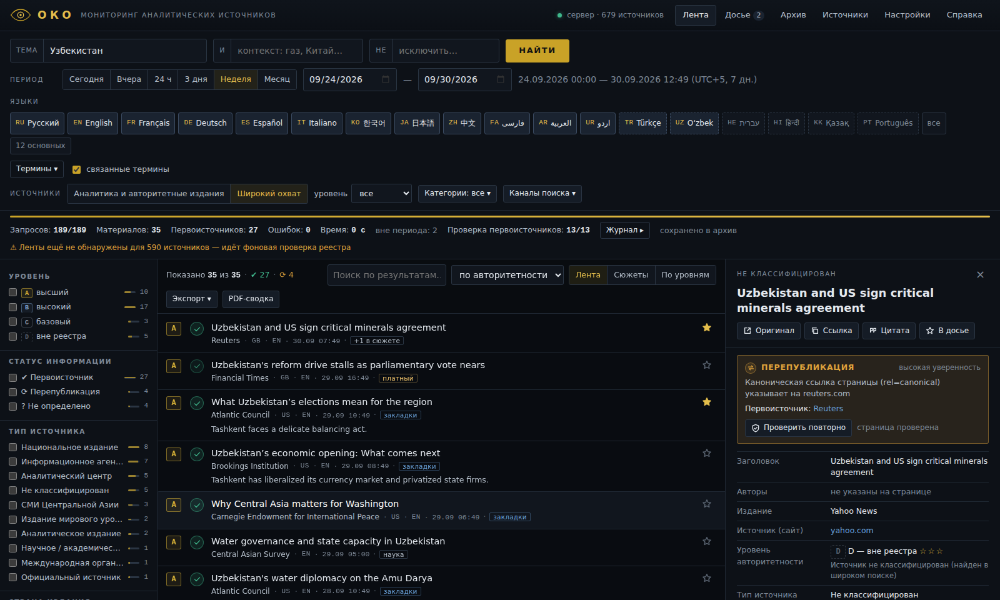

# ОКО — мониторинг аналитических источников

**ОКО** — персональная платформа аналитика. Она ищет всё, что мировые аналитические центры, международные организации, официальные источники и авторитетные издания публикуют об **Узбекистане**, а также по любой другой теме, за точно заданный период.

- **Один запрос — 12+ языков.** Слово «Узбекистан» автоматически превращается в *Uzbekistan, Ouzbékistan, Usbekistan, Uzbekistán, 우즈베키스탄, ウズベキスタン, 乌兹别克斯坦 / 烏茲別克, ازبکستان, أوزبكستان*, в турецкий и узбекский варианты. Добавляются столица и глава государства. Термины можно посмотреть и исправить.
- **Все страны мира.** Google News опрашивается по изданиям разных стран: США, Великобритания, Индия, Пакистан, Франция, Германия, Испания, Мексика, Италия, Корея, Япония, Китай, Тайвань, Саудовская Аравия, Египет, ОАЭ, Турция. Дополнительно — GDELT (мировые СМИ на 65 языках), Bing News и адресные запросы к сайтам аналитических центров.
- **Реестр из 679 источников.** В него вошли все 276 аналитических центров и изданий из вашего раздела закладок «Аналитика» (15 стран). Добавлены международные организации, официальные источники Узбекистана, агентства, специализированные издания по Центральной Азии, рейтинги и индексы. Полный список — в [SOURCES.md](SOURCES.md).
- **Уровень авторитетности** у каждого материала: **A** — высший, **B** — высокий, **C** — базовый, **D** — вне реестра.
- **Первоисточник или перепубликация** — отметка ✔ / ⟳ / ? с обоснованием: «материал агентства Reuters», «canonical указывает на reuters.com», «совпадает с публикацией ТАСС» и т. п.
- **Карточка материала:** заголовок, авторы, издание, сайт-источник, страна, язык, дата, доступ (платный или свободный), государственная принадлежность, сюжет (кто опубликовал первым).
- **PDF:** страница оригинала, чистый текст в режиме чтения, сводка по ленте, досье. Сохранение в веб-архив, перевод, библиографическая ссылка по ГОСТ.
- **Платный контент не теряется.** Для FT, WSJ, Economist, Nikkei и других показываются как минимум заголовок, издание, дата и ссылка.



*Интерфейс ОКО. На снимке — демонстрационные данные из тестовой эмуляции источников.*

---

## Установка и запуск

Нужен только **Python 3.8 или новее**. Сторонние библиотеки не требуются.

| Система | Как запустить |
|---|---|
| **Windows** | Дважды щёлкните **`START_OKO.bat`**. Если Python не установлен, откроется python.org: установите, отметив *«Add python.exe to PATH»*, и запустите снова. |
| **macOS** | Дважды щёлкните **`START_OKO.command`**. Если система не даёт открыть: правый щелчок → «Открыть». |
| **Linux** | `./start_oko.sh` или `python3 oko.py` |

Откроется браузер с адресом `http://127.0.0.1:8765/`. Окно с чёрной консолью — это сервер ОКО: не закрывайте его, пока работаете. Сервер доступен только на вашем компьютере.

При первом запуске ОКО в фоне проверяет сайты реестра и находит их RSS-ленты и поиск по сайту. Это занимает несколько минут и повторяется раз в неделю. Поиском можно пользоваться сразу.

> Если открыть `web/index.html` двойным щелчком без запуска сервера, ОКО работает в **автономном режиме**: доступны только GDELT и OpenAlex, без проверки первоисточников и PDF.

---

## Ежедневная работа

1. Запустите ОКО. Тема по умолчанию — **«Узбекистан»**.
2. Выберите период: **Сегодня · Вчера · 24 ч · 3 дня · Неделя · Месяц** или свои даты. В выдачу попадает **только** заданный период: каждый материал проверяется по дате публикации.
3. Нажмите **НАЙТИ** или Enter. Материалы появляются по мере ответа источников, ход виден в строке прогресса и в «Журнале».
4. По умолчанию показываются **аналитика и авторитетные издания** из реестра. Кнопка **«Широкий охват»** добавляет все найденные источники (уровень D).
5. Отбор — фильтрами слева: уровень, статус (первоисточник / перепубликация), тип источника, страна издания, язык, издание, доступ, «Новое с прошлой проверки», «Из ваших закладок».
6. Щелчок по материалу открывает карточку. ОКО сразу проверяет страницу: авторов, canonical, агентские пометки, платный доступ. Заголовок — ссылка на оригинал.
7. Важное отмечайте ☆ — оно попадёт в **«Досье»** вместе с вашими заметками. Из досье и из ленты формируется **PDF-сводка**.
8. Каждый поиск автоматически сохраняется в **«Архив»**: результаты прошлых дней можно открыть без повторного запроса.

**Поле «и»** уточняет тему: *Узбекистан* **и** *газ, Китай*. **Поле «не»** исключает материалы с указанными словами. Несколько тем через запятую ищутся как «ИЛИ». Любое ключевое слово на любом языке переводится автоматически: встроенный словарь → Wikidata (точные названия стран, людей, организаций) → машинный перевод. Правки в панели **«Термины»** запоминаются.

**Клавиши:** `/` — к поиску · `J`/`K` — следующий/предыдущий · `O` — открыть оригинал · `S` — в досье · `C` — проверить первоисточник · `Esc` — закрыть карточку.

---

## Как ОКО определяет уровень и статус

**Уровень авторитетности** берётся из реестра, его можно менять в разделе «Источники»:

| | Уровень | Кто входит |
|---|---|---|
| **A** | высший | Ведущие аналитические центры мира (Chatham House, IISS, RUSI, Carnegie, CSIS, Brookings, RAND, CFR, Atlantic Council, SWP, IFRI, ECFR, Crisis Group…), международные организации (ООН, ВБ, МВФ, АБР, ЕБРР, ОБСЕ, ШОС, ОТГ…), официальные источники (президент, правительство, МИД), Reuters, AP, AFP, Bloomberg, FT, WSJ, NYT, Economist, Le Monde, Nikkei, рейтинговые агентства и индексы |
| **B** | высокий | Национальные аналитические центры и качественные издания, национальные агентства (включая государственные — с пометкой «гос.»), профильные издания по Центральной Азии (Eurasianet, The Diplomat, CABAR, Kun.uz, Газета.uz…) |
| **C** | базовый | Прочие известные СМИ |
| **D** | вне реестра | Найдено в широком поиске; официальные домены (`.gov`, `.int`, `.gouv.fr`…) распознаются автоматически |

**Статус информации:**

- ✔ **Первоисточник (оригинал)** — собственный материал организации или издания: аналитика, доклад, официальное заявление, научная статья, агентская новость; либо самая ранняя из совпадающих публикаций.
- ⟳ **Перепубликация** — есть ссылка на другое издание («сообщает Reuters», «(AFP)», «— ТАСС», «据新华社», «（共同）», «نقلا عن رويترز»…), заголовок совпадает с более ранней публикацией, материал размещён агрегатором или площадкой переводов (Yahoo, MSN, ИноСМИ, Courrier international…), либо страница сама указывает первоисточник (`rel=canonical`, `original-source`, `isBasedOn`).
- **?** **Не определено** — признаков недостаточно. Кнопка «Проверить первоисточник» загружает страницу и изучает её.

Статус всегда сопровождается **обоснованием** и **степенью уверенности**. Это автоматическая оценка: ключевые материалы сверяйте по оригиналу.

---

## Каналы сбора

| Канал | Что даёт | Ограничения |
|---|---|---|
| Google News | Издания ~25 стран на 17 языках, точный период, адресный поиск по сайтам аналитических центров (`site:`) | ≤100 материалов на запрос — длинный период ОКО делит на части. Лимит ~80 запросов на поиск (настраивается) |
| GDELT | Мировые СМИ на 65 языках, страна издания | Только последние ~3 месяца; 1 запрос в 5 секунд |
| RSS-ленты реестра | Свежие публикации аналитических центров и изданий напрямую | Лента хранит только последние материалы |
| Поиск по сайтам (WordPress API) | Полнотекстовый поиск на сайтах аналитических центров с точными датами | Только для сайтов на WordPress |
| Bing News | Дополнительный охват | Около месяца |
| OpenAlex | Научные статьи с авторами, журналами, DOI | — |
| Всемирный банк | Доклады и документы с PDF | — |
| GOV.UK | Официальные публикации Великобритании | — |
| ReliefWeb | Доклады ООН и НКО | Нужен бесплатный `appname` (Настройки) |

Сбой одного канала не мешает остальным: ошибки видны в «Журнале».

---

## PDF и сохранение

- **PDF оригинала** — страница сохраняется через установленный Chrome, Edge, Яндекс.Браузер или Brave в папку `pdf/`.
- **PDF (режим чтения)** — чистый текст статьи с таблицей метаданных: издание, авторы, статус, уровень, ссылка, дата обращения.
- **Режим чтения / печать** — тот же текст в браузере: «Печать → Сохранить как PDF».
- **PDF-сводка** — отчёт по текущей выборке, сгруппированный по уровням, со статусами и ссылками.
- **Экспорт:** CSV для Excel, HTML-отчёт, JSON.
- **Веб-архив:** сохранение копии страницы в Wayback Machine или archive.today.

---

## Реестр и ваши закладки

Раздел **«Источники»**:

- показывает все 679 источников с фильтрами по стране, типу, уровню, каналу и закладкам;
- позволяет изменить уровень или отключить источник прямо в таблице;
- добавляет новый источник через «Добавить источник»;
- импортирует закладки браузера: **«Импорт закладок (HTML)»** принимает файл экспорта Edge, Chrome или Firefox. ОКО покажет, какие сайты уже в реестре, и определит страну по названию папки («Индия. Аналитические центры, издания» → IN).

---

## Где хранятся данные

| Папка | Содержимое |
|---|---|
| `data/sources.json`, `data/lexicon.json`, `data/languages.json` | Реестр, словарь, языки (входят в поставку) |
| `data/state/` | Ваши настройки, глоссарий переводов, досье, история, архив поисков, правки реестра |
| `data/cache/` | Кэш ответов источников и найденных лент (удаляется автоматически) |
| `pdf/` | Сохранённые PDF |

Для переноса на другой компьютер скопируйте папку ОКО целиком.

---

## Если что-то не работает

- **«Нет связи с сервером ОКО»** — окно-консоль закрыто. Запустите ОКО снова.
- **macOS: ошибка SSL-сертификата** — выполните `Applications → Python 3.x → Install Certificates.command`.
- **Google News: «ограничил запросы»** — Google временно притормозил частые запросы. ОКО делает паузу на 10 минут, остальные каналы работают. Можно уменьшить лимит в «Настройках».
- **Корпоративная сеть с прокси** — ОКО учитывает переменные `HTTPS_PROXY` / `HTTP_PROXY`.
- **PDF оригинала не создаётся** — нужен Chrome, Edge или другой браузер на Chromium. Путь к браузеру можно задать переменной `OKO_CHROME`. Без браузера используйте «Режим чтения → Печать».
- **Другой порт:** `python oko.py --port 9000`. Без автозапуска браузера: `--no-browser`.

---

## Для разработчика

```
oko.py                  запуск сервера (только стандартная библиотека Python)
okolib/
  net.py                HTTP: повторы, лимиты по хостам, кэш, защита от SSRF, режим фикстур
  feedparse.py          RSS 2.0 / RSS 1.0 (RDF) / Atom, повреждённые ленты, кодировки
  htmlmeta.py           метаданные статьи, признаки синдикации, режим чтения, обнаружение лент
  lexicon.py            мультиязычное расширение запроса (словарь → Wikidata → перевод)
  registry.py           реестр источников, пользовательские правки, обнаружение лент и WordPress API
  search.py             оркестрация поиска, строгий фильтр периода, склейка дублей, поток событий
  providers/            Google News, GDELT, RSS и WordPress, Bing, OpenAlex, Всемирный банк, GOV.UK, ReliefWeb
  server.py             локальный веб-сервер и API (токен сессии, проверка Host)
  pdfprint.py           PDF через headless Chromium
web/
  index.html, assets/oko.css, assets/oko-app.js    интерфейс
  assets/oko-core.js    классификация: уровни, первоисточник/перепубликация, сюжеты (браузер и Node.js)
tests/                  модульные и интеграционные тесты, эмуляция источников (fixtures/upstream)
tools/                  сборка oko-data.js и SOURCES.md
```

Тесты:

```
python -m unittest discover -s tests -v
node --test tests/core.test.js
```

Интеграционные тесты запускают сервер на эмулированных ответах источников: `python oko.py --fixtures tests/fixtures/upstream`.
